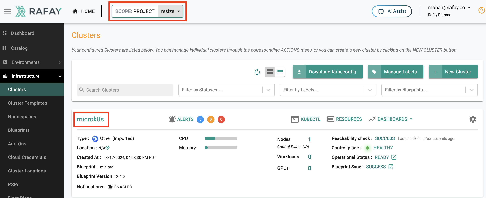
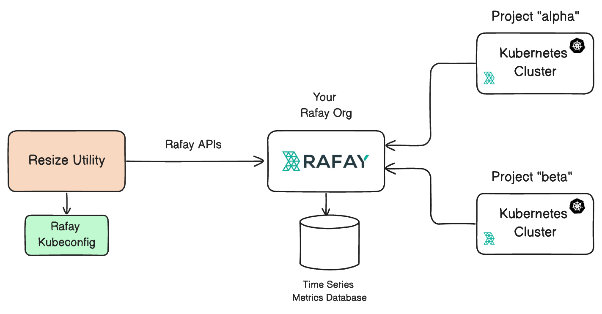
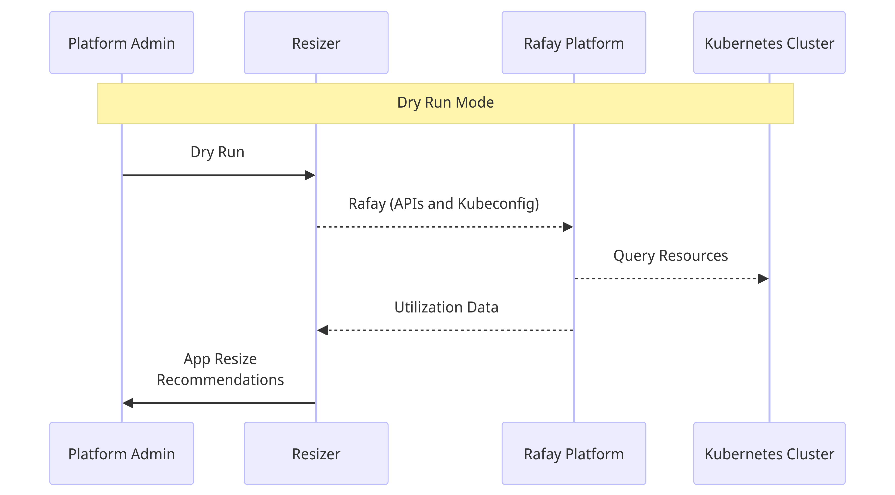
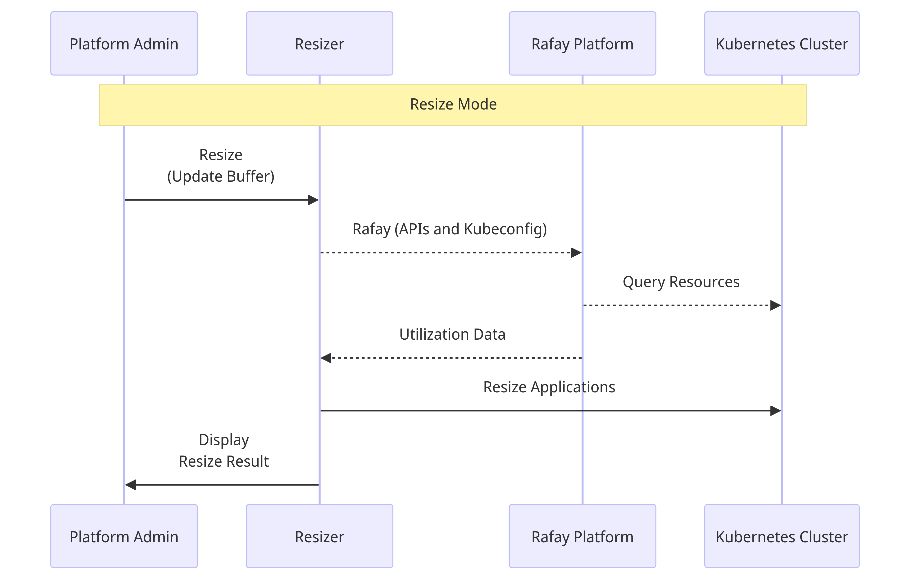
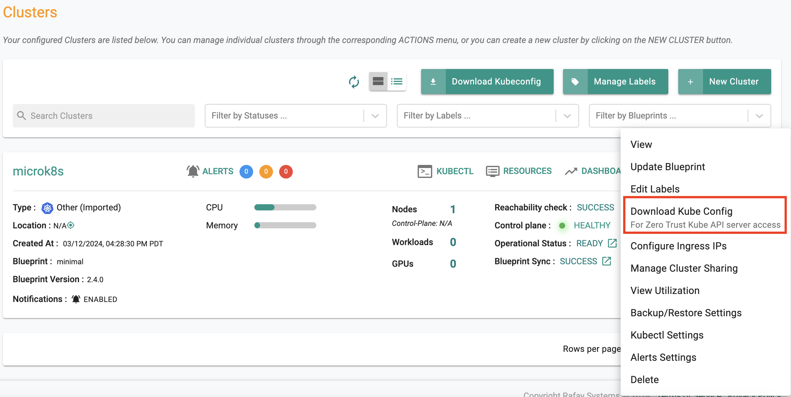

# Introduction

This utility is designed to help users perform the following:

- Identify applications with **over-allocated resources** on a Kubernetes cluster 
- Optimize the resource allocation for applications by resizing them 

# Prerequisites

Ensure that the following are installed on the system (Windows, MacOS or Linux) where you plan to run this tool.

## Python 3.x 

- [python3](https://www.python.org/downloads/)

## Python Libraries

- [python3-requests](https://pypi.org/project/requests/), 
- [kubernetes](https://pypi.org/project/kubernetes/), 
- [PrettyTable](https://pypi.org/project/prettytable/)

## Import Cluster to Rafay Org

Ensure you import your Kubernetes cluster into a [Project](https://docs.rafay.co/security/tenancy/projects/) in a Rafay Org. Sign up for a [Free Rafay Org](https://rafay.co/start/) if you do not have one already. 

The image below shows an imported cluster called "microk8s" operating the project called "resize". 



---

# Design & Architecture 

The diagram below describes what the overall system would look like for a scenario with two Kubernetes clusters targeted for application resizing. 




In order to identify over provisioned resources, the resize tool needs to perform the following: 

## Step 1

Query the Kubernetes cluster for the list of resources across all namespaces. Note that some namespaces (kube-system, rafay-system and rafay-infra) are whitelisted and skipped. 

To do this, the resize tool programmatically downloads the kubeconfig file for the target cluster from the Rafay Org and uses the **[zero trust kubectl channel](https://docs.rafay.co/accessproxy/overview/)** to securely access the **remote** cluster's API server that is operating behind a firewall. 

This allows the resize tool to query the manifests for the resources and determine if [requests and limits](https://kubernetes.io/docs/concepts/configuration/manage-resources-containers/) have been configured or not. 

## Step 2

Identify the resources that are over-provisioned. 

To do this, the resize tool programmatically queries the multi tenant Rafay time series database for **[metrics and usage](https://docs.rafay.co/dashboard/overview/)** data. This provides it with **actual resource usage** data over a 24 hour time period. Using the peak data point from a 24-hour time window ensures that the resize tool generates recommendations that are closer to real life usage. 


## Step 3 

The resize tool now compares data from "step 1 (configured resources)" and "step 2 (actual usage)" to calculate a realistic resource requests/limits configuration. Admins can optionally configure a **buffer** that will be automatically applied to the resource recommendations. 

If the dry-run mode is specified, no changes of any kind are made to the target cluster. If not enabled, the resize tool will apply the updated requests/limits to the identified resources on the target cluster. 

## FAQ

This section captures behavior of the resize tool for very specific scenarios. 

### No Requests/Limits 

For resources that are not originally specified with requests and/or limits, resize will provide resource recommendations. 

### Zero Usage 

For resources that have **zero** actual resource usage, resize will provide a resource recommendation that maps to the specified minimum baseline. This is required to make sure that resources are not inadvertently resized to zero. 

### Export Data

The tool automatically generates a CSV file with the findings and recommendations. Users can then share this csv file with others internally. 

---

# One Time Setup 

## Import Cluster 

As an [Org Admin](https://docs.rafay.co/security/rbac/roles/) in your Rafay Org, 

- Create a project
- [Import](https://docs.rafay.co/clusters/import/overview/) your cluster into this project with a cluster blueprint that has the visibility/monitoring add-on enabled. 

You can optionally follow the [Getting Started](https://docs.rafay.co/learn/quickstart/basics/overview/) guide for step-by-step instructions. 

## Configure Resize

When operated as a standalone tool on a system outside the target Kubernetes cluster, ensure that you configure the following environment variables for your [Rafay Org](https://docs.rafay.co/security/rbac/orgs/). This allows the utility to programmatically interrogate the target Kubernetes cluster to determine resource utilization for the existing applications. 

Export following environment variables.

```
export USER=rafay_console_username
export PASSWORD=rafay_console_password
export PROJECT=rafay_project_name
export CLUSTER=cluster_name
export KUBECONFIG=rafay_ztk_kubeconfig_file
```

Note that you can download the Rafay ZTKA kubeconfig file by following the steps below: 

- Login into your Rafay Org
- Click on My Tools 
- Click on Download Kubeconfig

--- 

# Usage 

Once you have completed the one-time setup as described above, follow the steps below. 

## Help

To run the resize tool and enquire for help 

```
python3 resize.py -h 
```

## Dry Run Mode 

The dry-run mode is useful to get a **read-only** view of current resource allocation, usage for all resources on the target Kubernetes cluster. The dry-run mode also provides a recommendation of changes to resource allocation. This provides the platform admin a view into the following: 

- The list of resources that are over-resourced 
- The recommended resource allocations for the identified resources 

The diagram below describes the various steps involved in this mode. 



To run a command with the dry-run option. 

```
python3 resize.py --dry-run
```

## Resize Mode 

This is the **default** mode. It updates the resource configurations (CPU/Memory requests) based on the **calculations**. The utility 

The diagram below describes the various steps involved in this mode. 



To run this command

```
python3 resize.py 
```

# Output

The tool always prints output clearly showing resource usage "before" and "after" resizing the resources. 

---

# Get Started 

Users that wish to experiment this on a new cluster can follow the steps described below. 

## Step 1: Import Cluster 

Create a custom blueprint with "minimal" as the base blueprint and with the "visibility & monitoring" add-on enabled. Now, import your cluster into a new project in Rafay. You can follow the step-by-step instructions in [Part-1](https://docs.rafay.co/learn/quickstart/basics/overview/) in this guide. 

The image below shows an imported cluster called "microk8s" operating the project called "resize". 


## Step 2: Download Kubeconfig 

In this step, you will download the Kubeconfig file for your cluster. In the Rafay Console, click on the gear icon on the right of your cluster and download the Kubeconfig file to your laptop. Once you have downloaded the file, export the kubeconfig file to your path so that you can use it for ongoing kubectl operations. 




```
export KUBECONFIG=<path to downloaded kubeconfig file>
```

Now, verify that you can reach the remote cluster by typing a simple kubectl command. 

```
kubectl get node
```

You should see a response similar to the one below

```
NAME              STATUS   ROLES           AGE    VERSION
demo-mks-apple1   Ready    control-plane   323d   v1.28.1
```

## Step 3: Deploy Test Applications 

Before we can run the resize tool, we need some applications deployed on our cluster. Download the following files: [echo-alpha.yaml](https://github.com/RafaySystems/getstarted/tree/master/tools/resize/echo-alpha.yaml) and [echo-beta.yaml](https://github.com/RafaySystems/getstarted/tree/master/tools/resize/echo-beta.yaml) to your laptop. 

Execute the following commands to deploy these applications to your cluster. 

```
kubectl create namespace test
kubectl apply -f stress.yaml -n test 
```

This will create the applications in the **test** namespace. It is recommended you wait for ~5 minutes after deploying your application to ensure that there is at least one metric data point at the centralized time series database. 

## Step 4: Dry Run with Resize 

```
python3 resize.py -d -n test
```

An illustrative example is shown below. Notice the following usage details for our application. 

### CPU 

The app developer has requested for **1 cpu** via the manifest (YAML). But, actual usage is only **23m**. This is an excellent candidate for resizing. 

### Memory 

The app developer has requested for **513 Mi** via the manifest (YAML). But, actual usage is only **84 Mi**. This is an excellent candidate for resizing. 

### Sample Output

```
==========Report Generated By Rafay Systems===========

Ignoring namespaces: ['kube-node-lease', 'kube-public', 'kube-system', 'rafay-infra', 'rafay-system']

Total Cluster Resource utilization (BEFORE)
+-------------------+---------------------+-------------------+--------------------------+----------------------------+--------------------------+
| CLUSTER_CPU_TOTAL | CLUSTER_CPU_REQUEST | CLUSTER_CPU_USAGE | CLUSTER_MEMORY_TOTAL(GB) | CLUSTER_MEMORY_REQUEST(GB) | CLUSTER_MEMORY_USAGE(GB) |
+-------------------+---------------------+-------------------+--------------------------+----------------------------+--------------------------+
|         8         |        2.733        |       0.269       |            67            |            3.72            |           5.42           |
+-------------------+---------------------+-------------------+--------------------------+----------------------------+--------------------------+
Cluster: demo-mks-apple
+-----------+--------------------------+-----------------------+-----------+----------------------+--------------------------+--------------+-------------------------+
| Namespace |           POD            | CPU_REQUESTS (BEFORE) | CPU_USAGE | CPU_REQUESTS (AFTER) | MEMORY_REQUESTS (BEFORE) | MEMORY_USAGE | MEMORY_REQUESTS (AFTER) |
+-----------+--------------------------+-----------------------+-----------+----------------------+--------------------------+--------------+-------------------------+
|    test   | busybox-6bc455f64c-25lqg |           1           |    23m    |         28m          |          512Mi           |     84Mi     |           105m          |
+-----------+--------------------------+-----------------------+-----------+----------------------+--------------------------+--------------+-------------------------+

Following pods/applications have not configured cpu/memory requests
+-----------+-----+-----------+--------------+
| Namespace | POD | CPU_USAGE | MEMORY_USAGE |
+-----------+-----+-----------+--------------+
+-----------+-----+-----------+--------------+
```


## Step 5: Resize Applications 

```
python3 resize.py -n test
```

### CPU 

Note that the cpu request has been updated in the deployment with the recommended value. 

### Memory 

Note that the memory request has been updated in the deployment with the recommended value. 

### Sample Output

```
==========Report Generated By Rafay Systems===========

Ignoring namespaces: ['kube-node-lease', 'kube-public', 'kube-system', 'rafay-infra', 'rafay-system']

Total Cluster Resource utilization (BEFORE)
+-------------------+---------------------+-------------------+--------------------------+----------------------------+--------------------------+
| CLUSTER_CPU_TOTAL | CLUSTER_CPU_REQUEST | CLUSTER_CPU_USAGE | CLUSTER_MEMORY_TOTAL(GB) | CLUSTER_MEMORY_REQUEST(GB) | CLUSTER_MEMORY_USAGE(GB) |
+-------------------+---------------------+-------------------+--------------------------+----------------------------+--------------------------+
|         8         |        2.837        |       0.273       |            67            |            3.78            |           5.44           |
+-------------------+---------------------+-------------------+--------------------------+----------------------------+--------------------------+
Cluster: demo-mks-apple
+-----------+--------------------------+-----------------------+-----------+----------------------+--------------------------+--------------+-------------------------+
| Namespace |           POD            | CPU_REQUESTS (BEFORE) | CPU_USAGE | CPU_REQUESTS (AFTER) | MEMORY_REQUESTS (BEFORE) | MEMORY_USAGE | MEMORY_REQUESTS (AFTER) |
+-----------+--------------------------+-----------------------+-----------+----------------------+--------------------------+--------------+-------------------------+
|    test   | busybox-76bfc76474-r7rg4 |          31m          |    24m    |         31m          |           111m           |    100Mi     |           111m          |
+-----------+--------------------------+-----------------------+-----------+----------------------+--------------------------+--------------+-------------------------+

Following pods/applications have not configured cpu/memory requests
+-----------+-----+-----------+--------------+
| Namespace | POD | CPU_USAGE | MEMORY_USAGE |
+-----------+-----+-----------+--------------+
+-----------+-----+-----------+--------------+
```

--- 

# Limitations 

The current version of the utility cannot resize pods with multiple containers. 

